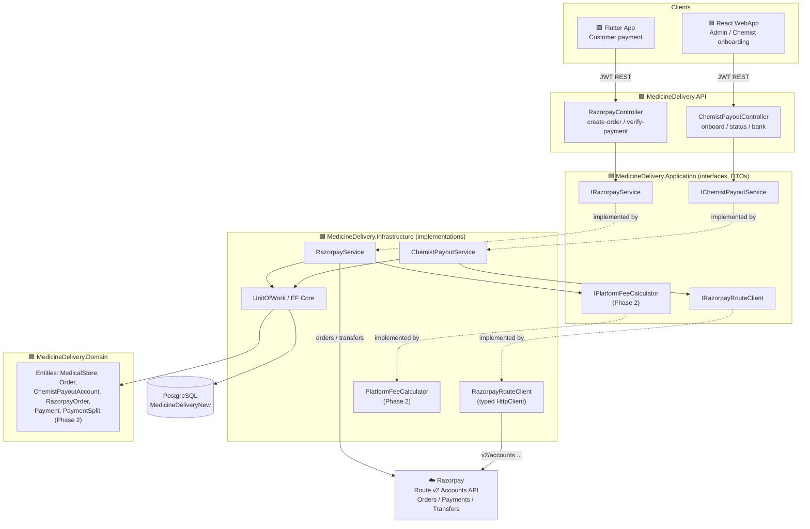
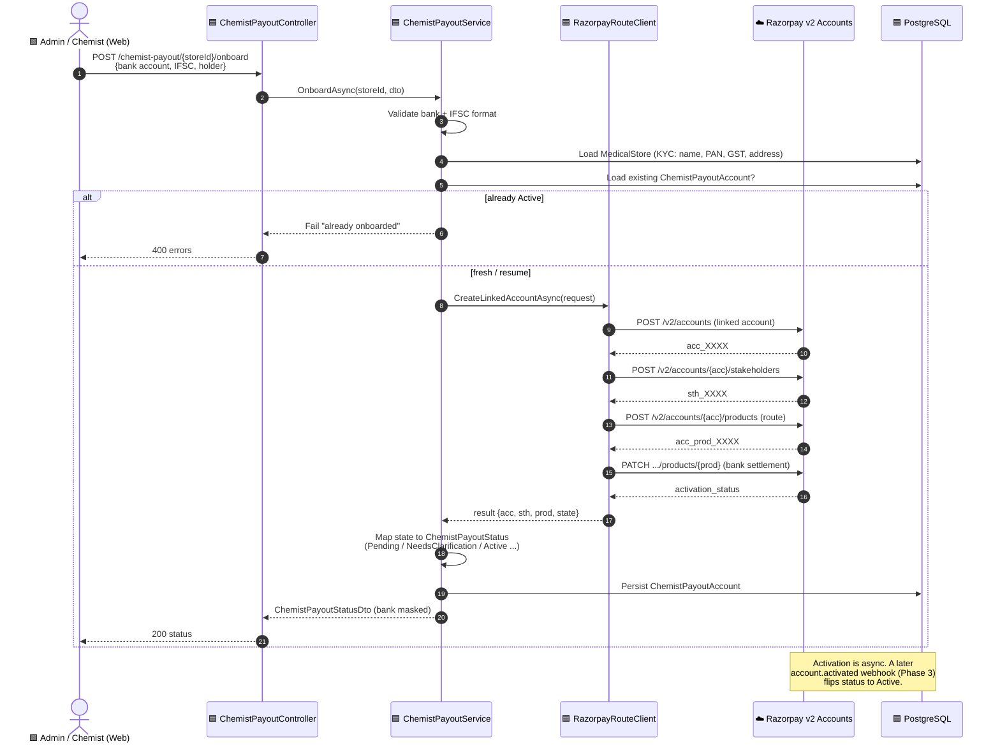
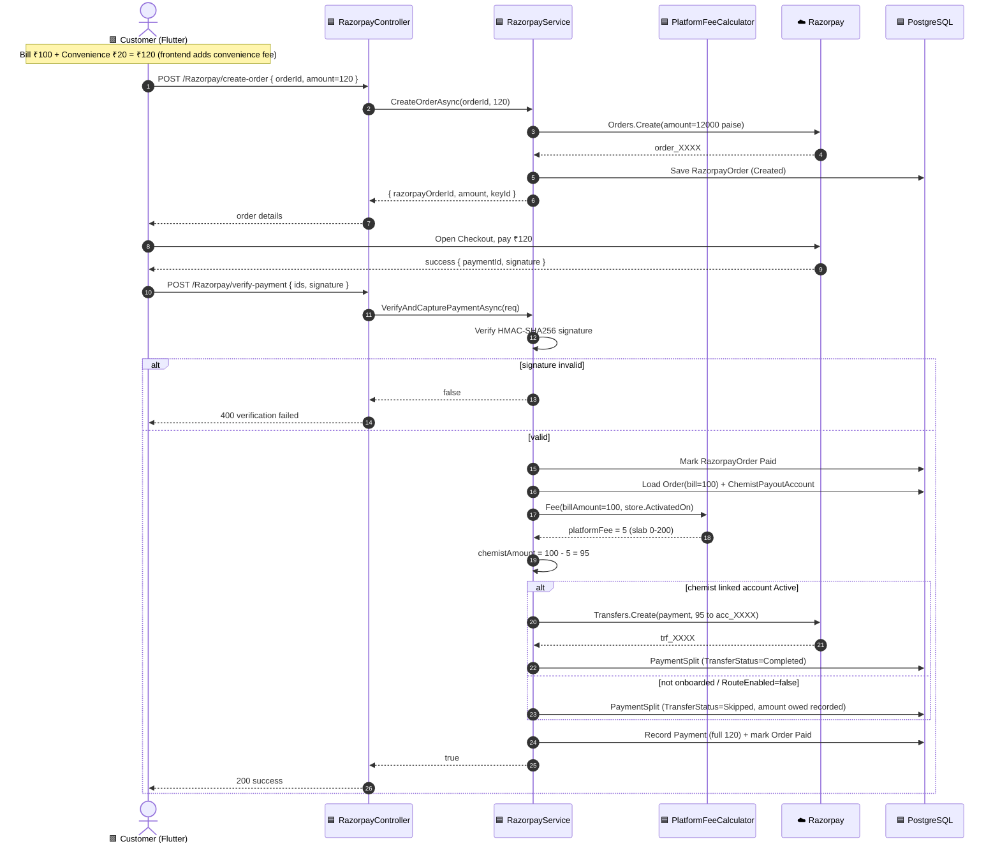
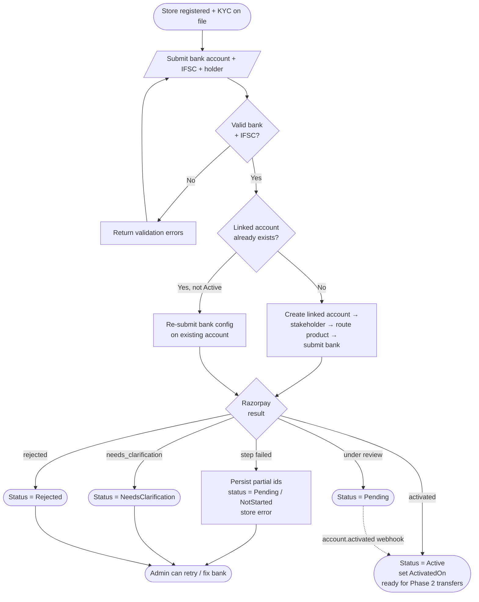
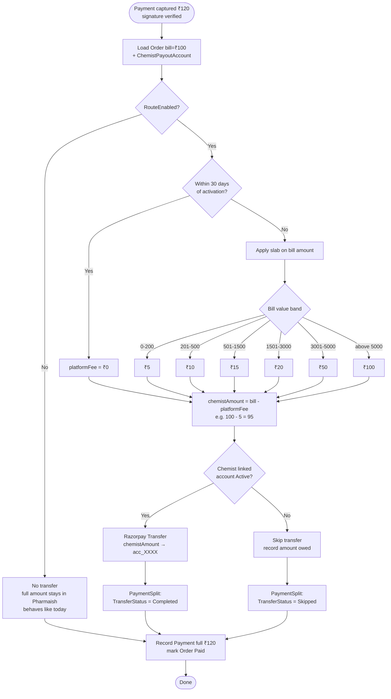
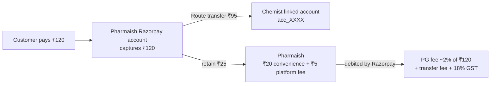

# Razorpay Route Split Payment — Diagrams

> Companion to [`paymentRoutePlan.md`](./paymentRoutePlan.md) and
> [`paymentImplementationPlan.md`](./paymentImplementationPlan.md).
> Diagrams use **Mermaid** (renders in GitHub / VS Code / most Markdown viewers).
>
> Legend: 🟦 backend · 🟩 web · 🟪 mobile · ☁️ external (Razorpay).
> **Phase 1** = chemist linked-account onboarding (built). **Phase 2** = order payment + split (planned).

---

## 1. System Architecture

---

## 2. Sequence — Phase 1: Chemist Linked-Account Onboarding

---

## 3. Sequence — Phase 2: Order Payment & Split

---

## 4. Flowchart — Chemist Onboarding State Machine

---

## 5. Flowchart — Payment Split & Platform Fee Slab

---

## 6. Money Split (worked example, ₹100 bill)

> Notes: the ₹20 convenience fee and the platform fee (slab on the ₹100 bill) both stay
> with Pharmaish; Razorpay's own fees are deducted from the Pharmaish balance, not from
> the chemist's ₹95 transfer.
